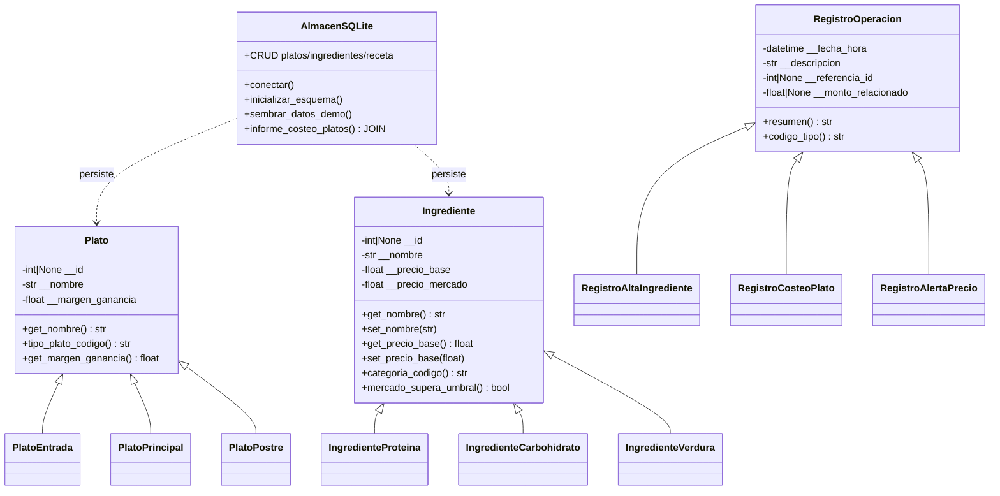

# Diagrama de clases — Chef-Costos (Corte 2)

Vista simplificada de la jerarquía OOP: **tres clases padre**, cada una con **tres hijas**, encapsulación con atributos privados (`__...`) y acceso mediante getters/setters.

La clase `AlmacenSQLite` no forma parte de las tres jerarquías de negocio exigidas; actúa como **capa de persistencia** entre objetos y SQLite.
