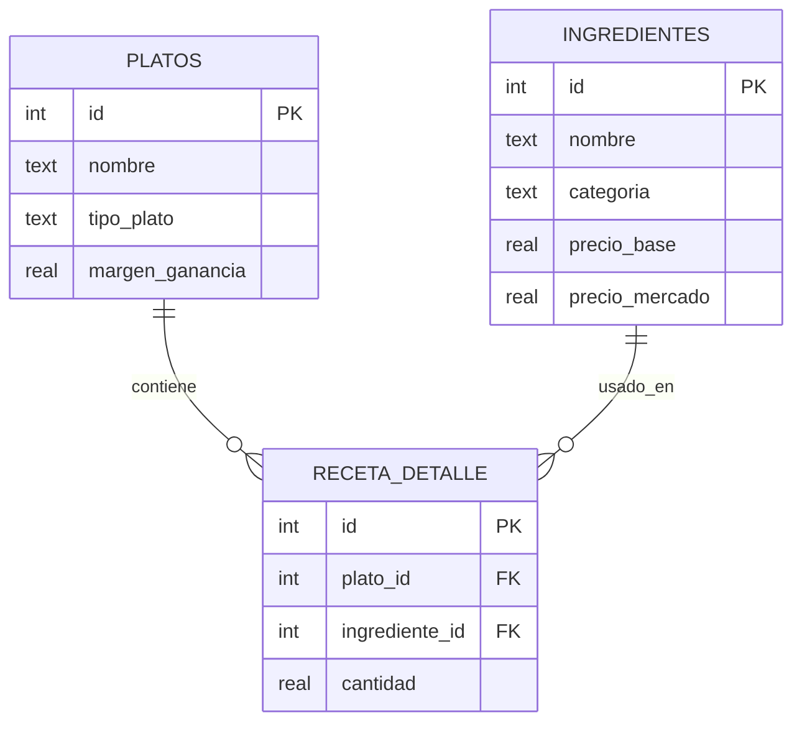

# Modelo entidad-relación (SQLite) — `base_datos_startup_grupo_sofia.db`

Tres tablas relacionadas con **PK** y **FK** (normalización básica: plato ↔ composición ↔ ingrediente).

### Reglas de negocio reflejadas

- Cada línea de `receta_detalle` asocia **un plato** con **un ingrediente** y una **cantidad** (factor por porción).
- Al eliminar un plato o un ingrediente, se eliminan primero las filas dependientes en `receta_detalle` (integridad referencial en la aplicación; SQLite con `ON DELETE CASCADE` y `PRAGMA foreign_keys=ON`).
- El **costeo** del MVP (Corte 1) se generaliza: \(\text{precio sugerido} = \sum(\text{cantidad} \times \text{precio\_mercado}) \times (1 + \text{margen})\), implementado en la consulta con `JOIN` y `GROUP BY`.
